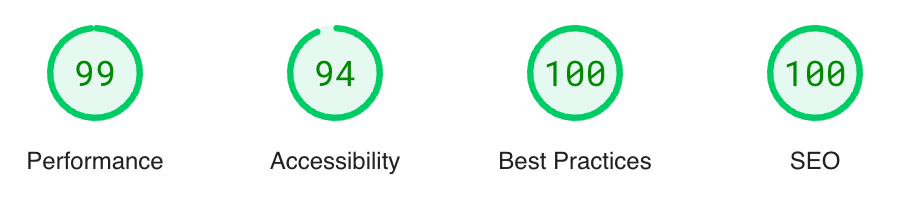

<h1 align="center">Parsley Paw Parlour</h1>

Click [here](https://natte2110.github.io/parsley-paw-parlour/) to view the live project on GitHub Pages.

This is a project created for a fictional cattery called ***Parsley Paw Parlour***. It is designed to be a intuitive and responsive design for the user to gain more information about the establishment - and the ability to book using an online form.

<h2 align="center"></h2>

## User Experience (UX)

### User Stories

-    #### Goals For A First-Time Visitor:

        1. As A First Time Visitor - I want to be able to understand the main purpose of the site, and find out useful information regarding the business.
        2. As A First Time Visitor - I want to be able to view reviews/testimonials from previous customers to decide if this is right for me.
        3. As A First Time Visitor - I want to be able to easily and interactively navigate through the site and it's pages to find what I need.

-    #### Goals For A Returning Visitor:

        1. As A Returning Visitor - I want to be able to find out how to book a visit at the establishment.
        2. As A Returning Visitor - I want to be able to find the price/daily rate for pet lodging.
        3. As A Returning Visitor - I want to be able to contact the business or visit to gain more information that I may require.

-    #### Goals For A Frequent Visitor:

        1. As A Frequent Visitor - I want to see if pictures of my cat have been uploaded to the company website during their stay.
        2. As A Frequent Visitor - I want to be able to book further appoointments/stays at the establishment.
        3. As A Frequent Visitor - I want to be able to view updates to the company's Terms & Conditions to see any changes which may affect my stay.

### Design

-   #### Colour Scheme

    -   The main colour scheme will be a light and approachable style, of which the colours will be picked respective of the background image.

-   #### Typography

    -   The main font used within the websites design will be Oswald, with a fall-back font of Sans-Serif if the Oswald font could not be loaded. The Oswald font gives off an approachable first impression.

-   #### Imagery

    -   Each individual page will be prefaced with a scrollable, fixed background image of a cat. A different image will be used each time to ensure the user is aware of a page change when they click an internal link.
    The background imagery will then be blurred as the user scrolls in order to stop it detracting from the main information on the page.

### Wireframes

[Desktop Home Page Wireframe](assets/media/desktop-wireframe.png)

[Mobile Home Page Wireframe](assets/media/mobile-wireframe.png)

## Features

-   ### Responsive

    -   The website will be responsive on all devices, with CSS media queries to change size and position of elements on different screen sizes.

-   ### Interactive

    -   The website will include interactive elements such as a booking form in order to add user engagement.

## Technologies Used

### Languages Used

-   [HTML5](https://en.wikipedia.org/wiki/HTML5)
-   [CSS](https://en.wikipedia.org/wiki/Cascading_Style_Sheets)
-   [JavaScript](https://en.wikipedia.org/wiki/JavaScript)

### External Frameworks, Programmes & Libraries Used

1. [Google Fonts:](https://fonts.google.com/)
    - Google fonts were used in order to import the Oswald font used in the design of the website. The link to the google font was placed in the head element of the html pages using it.
1. [Font Awesome:](https://fontawesome.com/)
    - Font Awesome was used to add icons to certain elements in order to provide more information about them, such as a 'Telephone' Icon to preface the company phone number.
1. [Bootstrap 4.1.3:](https://getbootstrap.com/docs/4.1/getting-started/introduction/)
    - Bootstrap was utilised in order to create the main structure of the page more easily, by using the ready-made components to create a responsive design/layout.
1. [jQuery:](https://jquery.com/)
    - jQuery worked in accordance with Bootstrap to add additional interaction and responsivity to the Navbar and other elements.
1. [Git](https://git-scm.com/)
    - Git was used for version control by using the terminal to add and commit files and messages when changes were made in order to keep a documented track of the development process.
1. [GitHub:](https://github.com/)
    - GitHub was used in order to store the files pushed from the terminal using git. It was also used to host the final project using GitHub Pages.
1. [Balsamiq:](https://balsamiq.com/)
    - Balsamiq was used to create the wireframes during the design process.
1. [GIMP:](https://www.gimp.org/)
    - GIMP was used when any changes to images were required, as it is a well known photo editing software.

## Testing

To test the project, the W3C Markup and CSS Validators were used to ensure no syntax errors were present in the final code.

The JSLint Validator was also used in order to verify the minimal JavaScript Code used.

-   [W3C Markup Validator](https://jigsaw.w3.org/css-validator/#validate_by_input) - [Results](assets/media/htmlvalidator-result.png)
-   [W3C CSS Validator](https://jigsaw.w3.org/css-validator/#validate_by_input) - [Results](assets/media/cssvalidator-result.png)
-   [JSHint JavaScript Validator](https://jshint.com/) - [Results](assets/media/jsvalidator-result.png)

[Page Speed Insights](https://pagespeed.web.dev/) was also used to assess the accessibilty & performance of the website.

### Testing User Stories from User Experience (UX) Section

-   #### First Time Visitor Goals

    1. As A First Time Visitor - I want to be able to understand the main purpose of the site, and find out useful information regarding the business.
        
        1. When the site is loaded, the user is greeted by a large image of a cat in a cattery, with a cover text which clearly depicts the purpose of the website/business. The first block of information when the page is scrolled also provides immediate information regarding the sites purpose.
        2. The User is also greeted with an indication to scroll down, as well as a clear navigation bar at the top of the screen if they wish to change the page.
        
    ###
    2. As A First Time Visitor - I want to be able to view reviews/testimonials from previous customers to decide if this is right for me.
    
        1. Once the user has ingested necessary information on the home page, the penultimate section is an interactive carousel with testimonials from previous customers, accompanied by corresponding images which catch the user's attention.
        2. The testimonial carousel is also on a timer to switch between different entries, which also serves to catch the user's attention if they have not already seen the section.
        
    ###
    3. As A First Time Visitor - I want to be able to easily and interactively navigate through the site and it's pages to find what I need.

        1. When entering the site, the user is greeted with a large navigation bar along the top with links to other pages. Each individual page is appropriately named and allows the user to easily find specific information such as prices and terms & conditions.
        2. The common navbar links are the same on each page and remain at the top when scrolled to ensure the user never feels trapped within the site.
        3. The navbar also changes from transparent to have a solid background dynamically when the page is scrolled in order to appear more visible over the other elements.
        
-   #### Returning Visitor Goals

    1. As A Returning Visitor - I want to be able to find out how to book a visit at the establishment.

        1. On both the home page and the 'prices' page, a "Book Now" button is available which upon clicking, displays a modal form in which the user can input information to book their stay.
        2. Along the navbar is a dropdown menu called 'Booking', which clearly indicates the sections with relevant information to booking, such as a price list, FAQ's and Terms & Conditions - This is so the user can be fully aware of the booking process and the rules behind it.
        
    ###
    2. As A Returning Visitor - I want to be able to find the price/daily rate for pet lodging.

        1. Along the navbar, in the 'Booking' dropdown menu is a specific page for prices. This individual page ensures that all the pricing information is in one central location, and the user can easily find the information required.
        2. The prices page contains a simple table with all the basic prices and what they entail.
        3. Another sub-table is also present further down the page listing individual prices for additional services the user can purchase.
        
    ###

    3. As A Returning Visitor - I want to be able to contact the business or visit to gain more information that I may require.

        1. Another individual page is available on the navigation bar called 'Contact Us' - This clearly links to a separate page containing information regarding the business location and contact information.
        2. The relevant contact information is also located within the footer of each page so that it is always readily available for the user.
        

-   #### Frequent Visitor Goals

    1. As A Frequent Visitor - I want to see if pictures of my cat have been uploaded to the company website during their stay.

        1. One of the navbar items links to a 'Gallery Page' which consists of many images of previous cat that have stayed at the establishment.
        2. The user is able to look at the images and see if their own cat has been uploaded to the gallery.
        
    ###

    2. As A Frequent Visitor - I want to be able to book further appointments/stays at the establishment.

        1. The user is able to book appointments both on the home page and the prices page, listed under the 'Booking' Drop down.
        2. They are also able to book a visit as specified in the Frequently Asked Questions page within the opening hours.
    ###

    3. As A Frequent Visitor - I want to be able to view updates to the company's Terms & Conditions to see any changes which may affect my stay.

        1. The user is able to view the Terms & Conditions page at any time, and is able to see if their cat meets the current requirements to stay.
        2. The user is able to easily access the Terms & Conditions page via the navigation bar or embedded internal links on other pages.

### Further Testing

- The website was tested on multiple browsers, including - Google Chrome, AVG Secure Browser, Chromium (Raspberry Pi) and Safari.
- The website was also tested across a few different devices. - MacBook Pro (MacOS), Windows 11 Laptop, and an iPhone 12 (iOS).
- Family members were consulted to receive feedback on the overall design and functionality of the website.
- Each link was tested on every individual page in order to ensure correct internal connection, as well as any external links.

### Known Bugs

- On Mobile Devices using Safari, some of the internal links appear blue instead of the specified text colour.

## Site Deployment

The project was hosted using GitHub pages. This was done using the following process.

- Locating the [Settings](https://github.com/Natte2110/parsley-paw-parlour/settings) Pane within the [GitHub Repository](https://github.com/Natte2110/parsley-paw-parlour).
- Under the [Pages](https://github.com/Natte2110/parsley-paw-parlour/settings/pages) section, the 'Main' branch was selected from the drop down within the 'Build And Deployment' sub-section.
- After a short wait, the [URL](https://natte2110.github.io/parsley-paw-parlour/) was generated for the live project.

## Credits

### Content

The content used within the website was adapted from results that were generated using [ChatGPT](https://chat.openai.com/) using prompts such as:

- "Write me a list of Terms & Conditions for a cattery busines"
- "Generate a list of Frequently Asked Questions for a cattery business.

### Media

The images used within the website were taken from multiple sources under the [Google Search](https://www.google.com) for "Cat In Cattery".

[Coolers](https://coolors.co/) Was used in order to find a suitable colour scheme for the websites colour scheme as it provides valuable insights and allows you to view the colours as someone with different type of colour blindness would.

### Code

- The CSS to keep the background image fixed in place was taken from this [Stack Overflow](https://stackoverflow.com/questions/22006587/how-to-make-div-background-image-responsive) post.
- This [W3Schools Page](https://www.w3schools.com/cssref/pr_background-position.php) was used to understand the **background-position** CSS Rule used when repositioning the background images on smaller screens.
- Again, this [W3Schools Page](https://www.w3schools.com/howto/howto_css_blurred_background.asp) was used to understand how to blur the background image using CSS so that is does not distract from the foreground information.
- In order to dynamically blur the background image based on the pages scroll location, this [Mozilla Developer](https://developer.mozilla.org/en-US/docs/Web/API/Document/scroll_event) page was utilised to further understand the windows.onscroll event.
- The [Bootstrap](https://getbootstrap.com/docs/4.3/getting-started/introduction/) documentation was also consulted regularly to understand the grid/layout system and the available bootstrap components. It was also used to help enable the website to be responsive and available to all devices.